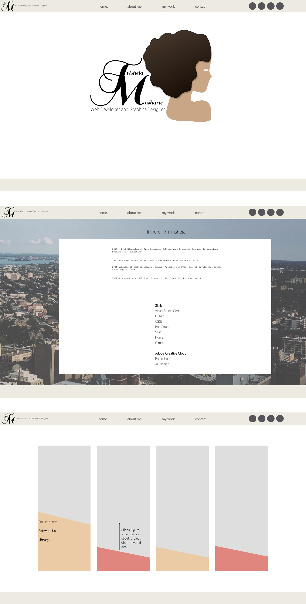

# Portfolio
## Front-End Web Development and Graphics Designer debut portfolio. 

Mockup and Prototype both created on Figma. Abstracted women created figma and edited on Photoshop  

### Branding Structure

### Mockup

### Prototype

 
The project windows are functioned by jQuery, sliding up effect revealing software used to create application and/or included projects.